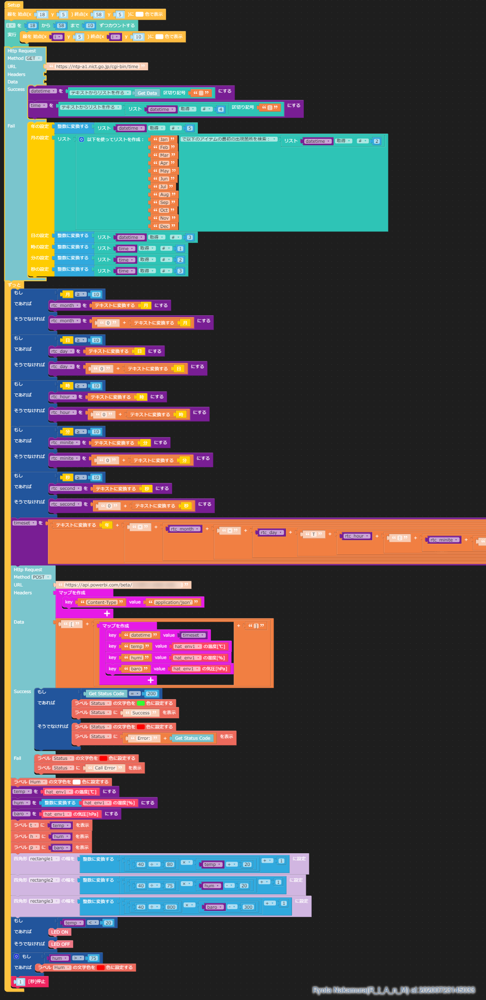

# この Blockly ファイルについて

ENVHatのデータを Power BI Streaming Dataset にPOSTする Blockly ファイルです。
サンプルの ENV Hat をベースに作成しています。

# RTC Clock 制御について

@GomiHgy さんの
以下のツイートの内容を参考にしました。
https://twitter.com/GomiHgy/status/1178327402700660736?s=20

カスタムブロックも用意されているようです！
[GomiHgy/M5StickC_NtpBlock](https://github.com/GomiHgy/M5StickC_NtpBlock)

# Power BI ストリーミングデータセットについて

データスキーマは以下のように作成してください。

# ブロックの構成

